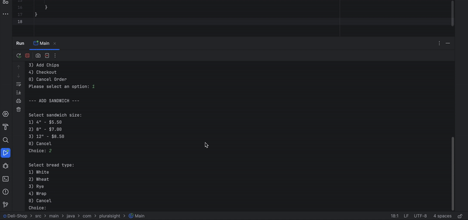

# Delicious Sandwiches

## Description of the Project

DELI-cious is a Java-based console application that simulates a point-of-sale (POS) system for a customizable sandwich shop. 
Customers can create their own sandwiches by selecting bread types, toppings, sauces, and extras.
The app also supports sides like Chips and Drinks, and provides detailed descriptions and prices for each order item.
## User Stories

- As a user, I want to start a new order or exit the application from the home screen
- As a user, I want to add a custom sandwich to my order
- As a user, I want to add drinks to my order by selecting a size and flavor
- As a user, I want to add chips to my order by selecting the chip type
- As a user, I want to view all the items in my order before checking out
- As a user, I want to confirm and save my order to a receipt file upon checkout
- As a user, I want premium toppings to add to the sandwich cost, with extra portions increasing the cost
- As a user, I want each part of the sandwich to be customizable and validated to prevent errors

## Class Diagram

## Setup

1. Clone the Repository
    1. git clone https://github.com/sharad101/Deli-Shop.git
    2. cd adv-dealership-project

2. Open/Launch in IntelliJ IDEA
   Launch IntelliJ IDEA
    1. Click File > Open
    2. Select the project folder you just cloned

3. Configure Project
    1. Go to File > Project Structure

4. Build and Run the Project
    1. Open the main class file (Main.java)
    2. Right-click on it and select Run 'Main.main()'

### Prerequisites

- IntelliJ IDEA: Ensure you have IntelliJ IDEA installed, which you can download from [here](https://www.jetbrains.com/idea/download/).
- Java SDK: Make sure Java SDK is installed and configured in IntelliJ.

### Running the Application in IntelliJ

Follow these steps to get your application running within IntelliJ IDEA:

1. Open IntelliJ IDEA.
2. Select "Open" and navigate to the directory where you cloned or downloaded the project.
3. After the project opens, wait for IntelliJ to index the files and set up the project.
4. Find the main class with the `public static void main(String[] args)` method.
5. Right-click on the file and select 'Run 'YourMainClassName.main()'' to start the application.

## Technologies Used

- Java 17

## Demo

## Interesting Code

      
    public boolean saveReceiptToFile(String receipt) {
        try {
            // Create receipts directory if it doesn't exist
            Files.createDirectories(Paths.get("receipts"));

            
            String filename = "receipts/" + generateFileName();

           
            try (FileWriter writer = new FileWriter(filename)) {
                writer.write(receipt);
            }

            System.out.println("Receipt saved to: " + filename);
            return true;
        } catch (IOException e) {
            System.err.println("Error saving receipt: " + e.getMessage());
            return false;
        }
    }

Purpose: The code check to see if a receipts file is generated. If not it creates one.
It automatically saves all unique receipts to the file, stored in an organize manner.

## Resources

List resources such as tutorials, articles, or documentation that helped you during the project.

- Raymond's Notes
- Potato Sensei

## Thanks

Express gratitude towards those who provided help, guidance, or resources:

- Thank you to Raymond for continuous support and guidance.

 